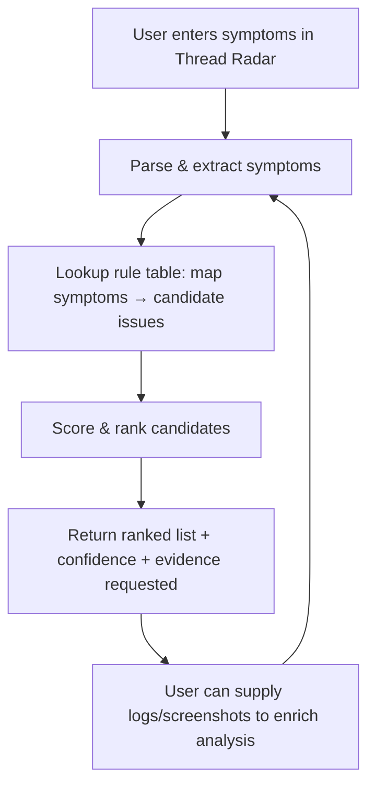

# Thread Radar — Symptom Analysis & Attack Prediction

Purpose: when a user reports PC/system problems or symptoms in the "thread radar", the system should analyze the text, extract observable symptoms, and return a ranked list of the most probable causes (including attacks). This document defines the approach, symptom→attack mappings, confidence hints, and a simple flowchart.

## High-level approach
- Input: free-text user description of symptoms (logs, visible behaviour, errors, slow performance, popups, strange network activity, files encrypted, etc.).
- Step 1 — Normalize & parse: lowercase, remove stop words, keep punctuation useful to extract error codes, filenames, IPs, ports.
- Step 2 — Symptom extraction: detect key symptom tokens and patterns (e.g., "ransom", "encrypted", "pop-up", "blue screen", "fan", "overheat", "strange process", "battery", "unknown program", "browser redirect", "credential prompt", "USB inserted", "disk full", "high CPU" etc.). Use regexes and small NLP entity extraction.
- Step 3 — Map symptoms to candidate causes: using a weighted rule table (see mapping below). Each candidate receives a score = sum(symptom_weight * presence) + context bonuses (e.g., multiple symptoms that co-occur increase score).
- Step 4 — Enrich with metadata (if available): timestamp, OS, installed AV, recent downloads, network indicators, attached devices, process names, file extensions, IPs. Use these to raise/lower confidence.
- Step 5 — Produce ranked list of probable issues (attacks + non-attack causes) with explanation and confidence band (High/Medium/Low) and required signals to raise confidence.

> Note: the system must treat non-security causes equally (hardware failure, software bug) to avoid false positives.

## Confidence scoring (suggested)
- Base scores: Each mapping has a base weight 1..10.
- Co-occurrence multiplier: if two or more strongly-linked symptoms appear together (e.g., "files encrypted" + "ransom note"), multiply by 1.5–2.0.
- Context bonuses: presence of indicators (known malicious IP, unexpected open ports, suspicious process name) add fixed points.
- Final banding: Score >= 18 → High, 10–17 → Medium, <10 → Low (adjustable during tuning).

## Symptom → Candidate attack mapping (comprehensive)
(For each symptom, list possible attacks/causes. The list is intentionally exhaustive.)

- Symptom: files renamed/encrypted, ransom note, changed file extensions
  - Candidate attacks: Ransomware (various families), targeted encryption attack, accidental encryption tool
  - High-confidence signals: ransom note text, encrypted file headers, mass file modifications, uncommon file extensions

- Symptom: data exfiltration indicators (unusually large outbound transfers, unknown outbound connections, new zipped archives)
  - Candidate attacks: Data exfiltration (C2 exfiltration), advanced persistent threat (APT), insider data theft, compromised backup uploads
  - Signals: unknown destinations, large transfers at odd hours, new accounts accessing data

- Symptom: frequent pop-ups or credential prompts, unexpected login prompts, account takeover signs
  - Candidate attacks: Phishing, credential harvesting, browser extension compromise, man-in-the-browser
  - Signals: suspicious URLs, form POST to unknown hosts, credential reuse alerts

- Symptom: unusual CPU/GPU usage, fans at high speed, sudden battery drain, high power use
  - Candidate attacks: Cryptomining (coinminer), resource abuse via malware, OS misconfiguration, heavy legitimate workloads
  - Signals: long-running unknown processes, connections to mining pools, high GPU usage by unknown process

- Symptom: new or unknown processes, autoruns, scheduled tasks created
  - Candidate attacks: Malware (trojan, RAT), persistence mechanisms, backdoor, supply-chain malware
  - Signals: unknown binary signatures, unsigned binaries in system folders, new persistence registry keys

- Symptom: remote control symptoms (mouse moves, windows open/close, files being copied remotely)
  - Candidate attacks: Remote Access Trojan (RAT), compromised remote desktop, malicious admin credentials
  - Signals: unfamiliar remote sessions (RDP, teamviewer), connections from unusual IPs, keystroke/logging evidence

- Symptom: network redirection, DNS changes, browser homepage changed, ads and redirects
  - Candidate attacks: Browser hijack, DNS poisoning, malicious proxy, ad-injection, compromised router
  - Signals: changed DNS servers, hosts file modifications, HTTP 302 to unknown domains

- Symptom: repeated login failures, account lockouts, authentication errors
  - Candidate attacks: Brute-force attack, credential stuffing, automated login attempts
  - Signals: many IPs hitting login endpoints, login attempts with many usernames

- Symptom: unexplained file deletions, sudden missing data
  - Candidate attacks: Wiper malware, destructive malware, accidental user action, disk corruption
  - Signals: file signature changes, disk errors, simultaneous deletion patterns

- Symptom: blue screen / kernel panic, sudden crashes
  - Candidate attacks/causes: Rootkit / kernel-level malware, driver corruption, hardware failure, kernel exploit attempts
  - Signals: unusual kernel modules, new unsigned drivers, recent kernel updates

- Symptom: device not booting, modified bootloader, unexpected boot behavior
  - Candidate attacks: Bootkit, UEFI/firmware compromise, disk failure
  - Signals: changes to MBR/EFI, firmware update records, secure boot disabled unexpectedly

- Symptom: unknown devices show up (USB autorun), external drives with strange files
  - Candidate attacks: USB-borne malware, supply-chain tampering, physical compromise, autorun worms
  - Signals: new removable device activity, autorun executed scripts, new driver installations

- Symptom: high network latency, many outbound connections, unfamiliar remote hosts
  - Candidate attacks: Botnet C2, proxy used for anonymizing activity, DDoS involvement, mass scanning
  - Signals: many DNS queries to suspicious domains, beaconing intervals, repeated connections to small set of hosts

- Symptom: browser extensions added unexpectedly, injected scripts in webpages
  - Candidate attacks: Browser extension compromise, supply-chain compromise of extension, XSS leading to persisted malicious script
  - Signals: new extension IDs, remote script URLs, modified extension store status

- Symptom: unexpected privilege escalations, UAC prompts for unknown apps
  - Candidate attacks: Privilege escalation exploit, local privilege misuse, malicious installer
  - Signals: unsigned installers, new services installed with SYSTEM privileges

- Symptom: suspicious log entries (authentication from unusual IPs, remote command execution), unexpected configuration changes
  - Candidate attacks: Lateral movement, credential theft, post-exploitation activity
  - Signals: use of admin tools from odd hosts, new scheduled tasks running scripts

- Symptom: unexpected modifications to system files, changed checksums
  - Candidate attacks: File-integrity compromise by malware or attacker, supply-chain tampering
  - Signals: mismatched hashes with known-good, replaced system binaries

- Symptom: unsolicited emails sent from user account, email bouncebacks with unknown content
  - Candidate attacks: Compromised email account, mailer bot, outbound spambot
  - Signals: spikes in outbound SMTP, new rules forwarding mail, mailbox rule creation

- Symptom: slow disk I/O, high disk usage, sudden disk space drop
  - Candidate attacks/causes: Ransomware (encrypting), log flood, local data exfiltration staging, disk failure
  - Signals: many small writes by unknown process, new archive files, disk SMART errors

- Symptom: suspicious process names masquerading as system processes
  - Candidate attacks: Process hollowing, masquerading malware, trojanized binaries
  - Signals: binary paths not matching legitimate locations, mismatched signatures

- Symptom: new listening ports, unexpected open services
  - Candidate attacks: Backdoor implant, C2 listener, rogue service
  - Signals: netstat shows unusual ports bound to unknown processes, recent firewall rule changes

- Symptom: message about license or activation changes, unusual system messages
  - Candidate attacks/causes: Software licensing malware, tampered software, legitimate licensing issues

- Symptom: no symptoms but user reports "I think I'm hacked"
  - Candidate attacks: social engineering, account compromise, latent threats — require telemetry enrichment

## Non-security causes (include to avoid misclassification)
- Hardware failure (CPU, GPU, disk, PSU, overheating)
- Driver issues, OS bugs, bad updates
- Legitimate heavy workloads (compilation, rendering)
- Low disk space, failing battery, throttling
- Misconfiguration

## Required signals to increase confidence
- File samples / file hashes
- Process list, autoruns, scheduled tasks
- Recent network connections & DNS logs
- System event logs, authentication logs
- Attached devices history
- Screenshots and ransom note text
- Timestamps and sequence of events

If none of these are available, predictions are lower-confidence and should be labeled accordingly.

## Output format (example)
- List of ranked probable issues (Top 3):
  1. `Ransomware` — High confidence (score 26). Evidence: "files encrypted", ransom note text, mass file rename.
  2. `Cryptominer` — Low confidence (score 6). Evidence: high CPU mentioned but no long-running unknown process listed.
  3. `Hardware failure` — Low confidence (score 5). Evidence: user mentions slow disk.
- For each candidate: short explanation, required additional evidence to confirm, recommended forensic steps.

## Flowchart (user-visible steps)

## Example mappings (short)
- "files encrypted", ".locked", "ransom" → Ransomware (High)
- "fan loud", "high cpu", "100% gpu" → Cryptominer or heavy task (Medium)
- "login attempts", "account locked" → Brute-force or credential stuffing (Medium)
- "browser redirects", "homepage changed" → Browser hijack or DNS attack (Medium)

## Implementation notes
- Start with a rule-based classifier (fast to implement). Augment later with small ML classifier trained on labeled symptom→cause pairs.
- Keep non-security causes in the candidate set to reduce false positives.
- Provide transparent reasons for each prediction (which symptoms contributed to the score).
- Store anonymized symptom→prediction pairs for iterative tuning.

---
File: `THREAD_RADAR_SPEC.md` (added to repository root). Use this as the authoritative spec for implementing the thread radar prediction feature.
