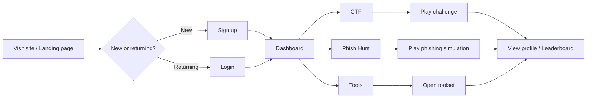
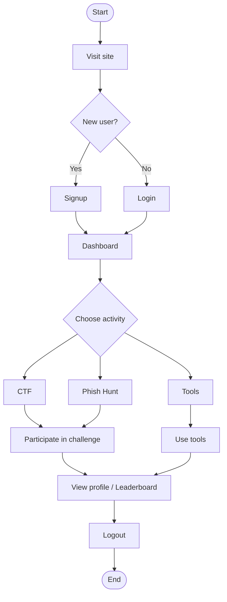

# User Flow Diagrams (User-facing actions only)

These diagrams show only what the user does — no internal services or implementation details.

## Block Diagram (user actions)

## Flowchart (linear user journey)

## Notes
- Shows only user-visible steps: signup/login → dashboard → select CTF/Phish Hunt/Tools → participate → view profile/leaderboard → logout.

